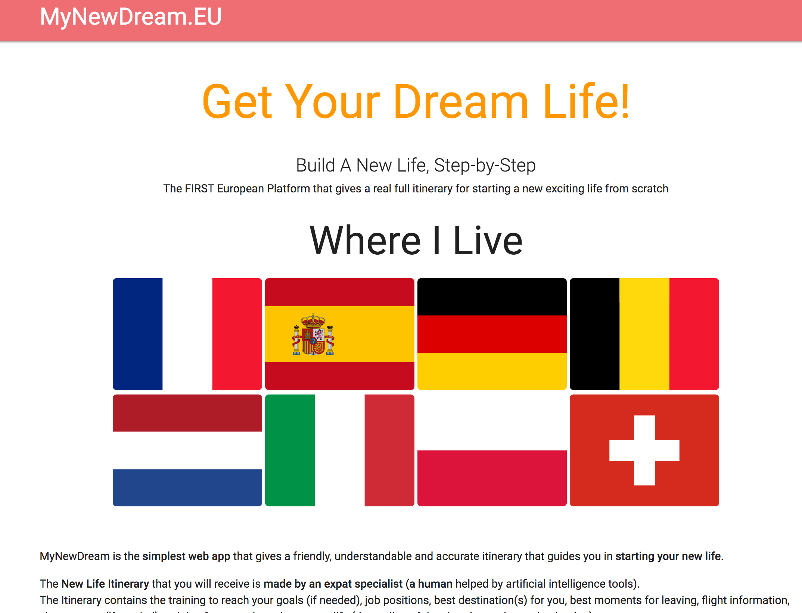

# MyDreamLife

MyDreamLife is a side-project I created to give a TODO-list, and Itinerary for a new (exciting) life. It is designed for European people from 18 to 30 (mainly from Spain, France, Netherlands, Belgium, Germany and Italy) who want to move and try a new life abroad but don't know the process to do it.

The artificial intelligence of the app will give them, ste-by-step, the whole map for starting their dream life & doing it!

## It's not MyDreamLife.eu, but MyNewDream.eu

Although both domain names were available, I distractedly typed a different name (maybe because I was speaking to people and drinking in the same time ...).
After the payment made, I sadly noticed my mistake but it was already too late.. Anyway, "MyDreamLife.eu" is actually "MyNewDream.eu"! There is worse in life!

## Requirements

* **Server** PHP 7.1 or newer

* **Database** MySQL/MariaDB 5.0.3 or newer

## Inventor & Author of MyDreamLife.EU

My name is [Pierre-Henry Soria](http://ph7.me) :smiley:
You can contact me at: *hi {{AT}} ph7 {{D0T}} me*

## Project URL

[https://mynewdream.eu](https://mynewdream.eu) :bowtie:

## License

Under [General Public License 3](http://www.gnu.org/licenses/gpl.html) or later.